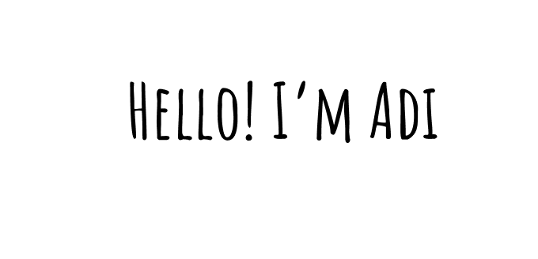

I’m a passionate Mobile Developer from Indonesia, focusing on Flutter to build impactful and high-quality apps.

**About Me**

- 💼 Passionate Flutter Mobile Developer from Indonesia, currently at PT. Mega Central Finance
- 🚀 I love crafting smooth, scalable Android & iOS apps with clean architecture (BLoC, GetX)
- 🧩 Excited about experimenting with Dart, building reusable components, and solving real-world problems
- 🌱 Always learning: sharpening API integration, improving performance, and refining clean architecture
- 💬 Ask me anything or connect [here](https://www.linkedin.com/in/adi-maulana)

#### Languages & Frameworks:

     
 

### 📱 Notable Projects
- **M-LinkPro** - My latest project, a mobile app designed for internal employee management, available on [Play Store](https://play.google.com/store/apps/details?id=id.co.macf.apps.employee) and iOS. The app features user authentication, real-time updates, and a clean, scalable architecture built with Flutter. It aims to streamline employee engagement and management processes in the organization.
